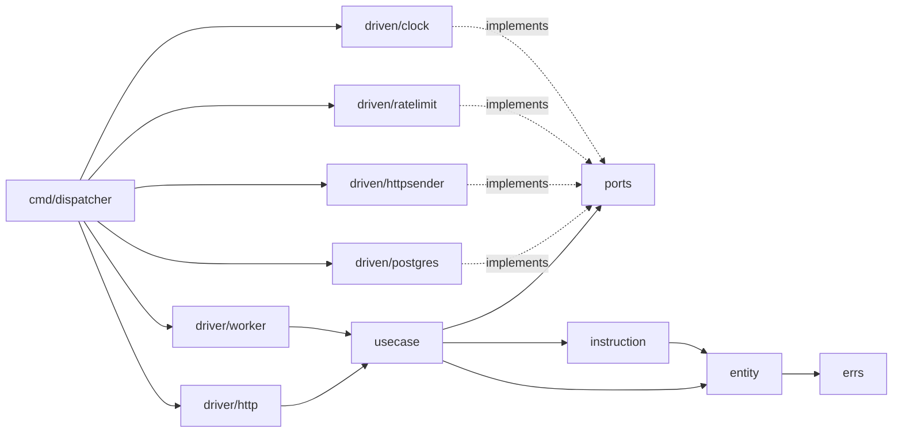
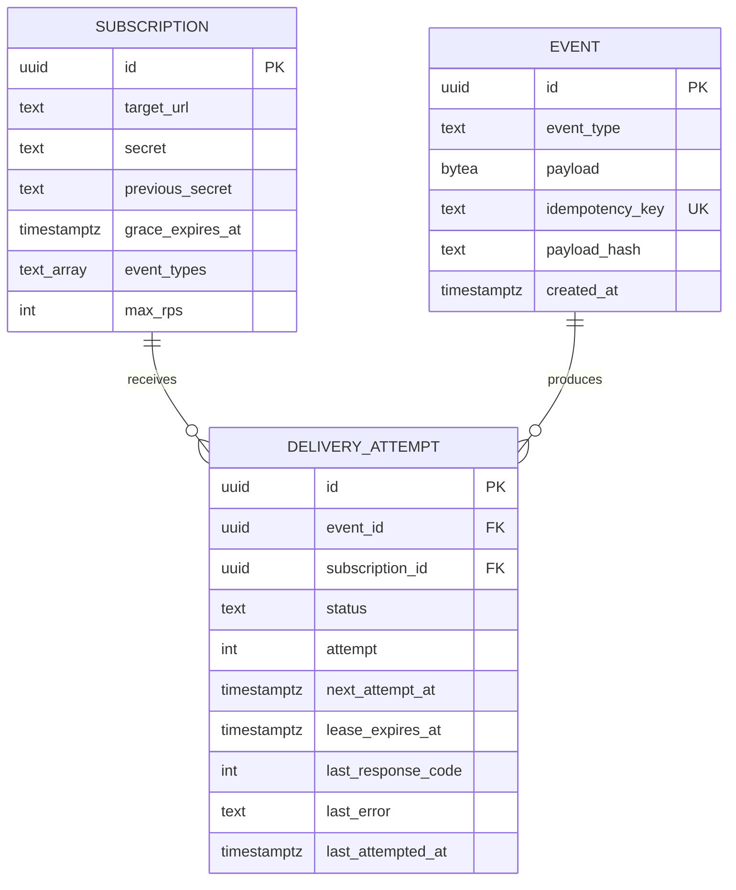
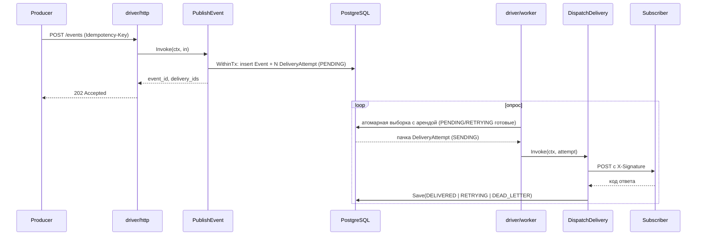
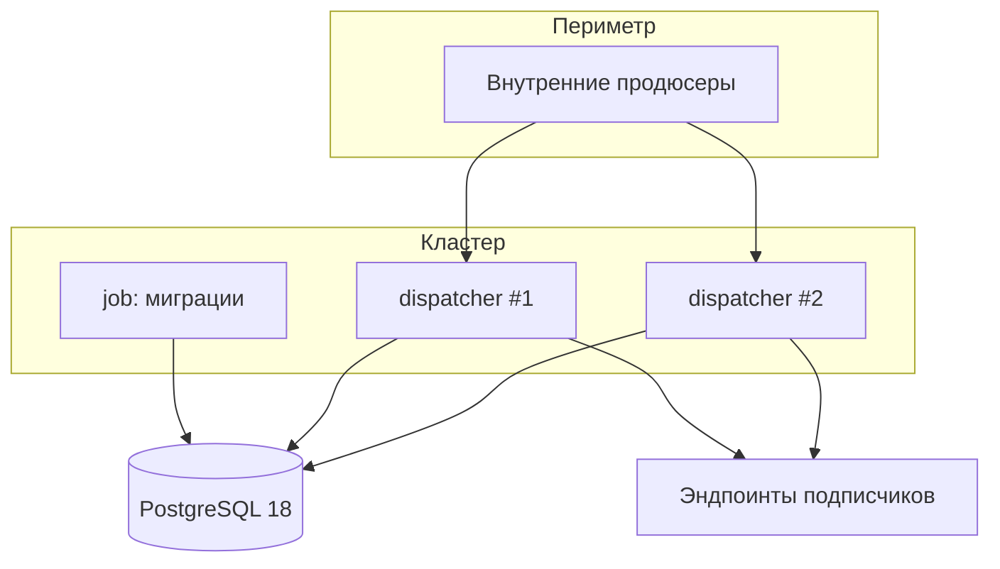

# Architecture Spine — Webhook Dispatcher

## Design Paradigm

**Гексагональная архитектура (ports and adapters)**, строгий вариант. Слой домена называется `application` и не импортирует ничего, кроме стандартной библиотеки и `github.com/google/uuid`. Адаптеры разделены на **driver** (вызывают usecase'ы) и **driven** (вызываются usecase'ами через порты) и не зависят друг от друга.

| Слой парадигмы | Каталог | Что живёт |
| --- | --- | --- |
| Domain | `internal/application/entity`, `internal/application/errs` | Сущности, инварианты, машина состояний, типизированные ошибки |
| Pure logic | `internal/application/instruction` | Чистые функции, переиспользуемые между usecase'ами |
| Application | `internal/application/usecase` | Сценарии, оркестрация портов |
| Ports | `internal/application/ports` | Все интерфейсы, объявленные потребителем |
| Driver adapters | `internal/adapter/driver/*` | HTTP-хендлеры, пул воркеров, реапер |
| Driven adapters | `internal/adapter/driven/*` | PostgreSQL, HTTP-отправитель, лимитер, часы, случайность |
| Composition root | `cmd/dispatcher` | Единственное место сборки графа зависимостей |



## Invariants & Rules

### AD-1 — Направление зависимостей [ADOPTED]

- **Binds:** all
- **Prevents:** просачивание инфраструктуры в домен и связывание адаптеров между собой, после чего логику невозможно тестировать и заменять
- **Rule:** `application/**` импортирует только stdlib и `github.com/google/uuid`. Пакет `internal/adapter/driven/X` не импортирует `internal/adapter/driven/Y` и не импортирует `internal/adapter/driver/*` (и наоборот). Единственный пакет, импортирующий адаптеры, — `cmd/dispatcher`. Правило проверяется тестом на импорты в CI, не только ревью.

### AD-2 — Порты объявляет потребитель, именует роль

- **Binds:** `application/ports`, все driven-адаптеры
- **Prevents:** порты, названные по технологии (`PostgresRepo`, `HTTPClient`), из-за чего домен становится привязан к реализации, а вторая реализация не влезает в интерфейс
- **Rule:** все интерфейсы объявлены в `application/ports` и названы по роли: `DeliveryRepository`, `EventRepository`, `SubscriptionRepository`, `WebhookSender`, `RateLimiter`, `Clock`, `RandSource`, `TxManager`. Ни один порт не содержит в сигнатурах типов из библиотек адаптера (`pgx.Tx`, `http.Response`, `time.Timer` — запрещены; `time.Time` и `time.Duration` из stdlib допустимы). Адаптер не объявляет собственных интерфейсов для домена.

### AD-3 — Usecase — это действие с единственным входом [ADOPTED]

- **Binds:** `application/usecase`, `application/instruction`, все driver-адаптеры
- **Prevents:** расползание сервисных объектов с десятком методов, к которым driver-адаптеры лепят собственные точки входа
- **Rule:** имя usecase'а и instruction'а — глагол в повелительном смысле (`PublishEvent`, `DispatchDelivery`, `ReclaimAbandonedDeliveries`). Единственный экспортируемый метод — `Invoke(ctx context.Context, in Input) (Output, error)`. Input/Output — структуры, объявленные рядом с usecase'ом. Driver-адаптер вызывает только `Invoke` и не имеет доступа к репозиториям.

### AD-4 — Контекст первым аргументом [ADOPTED]

- **Binds:** all
- **Prevents:** неотменяемые операции, из-за которых graceful shutdown не завершается, а горутины утекают
- **Rule:** каждый метод порта, адаптера, usecase'а и instruction'а, выполняющий ввод-вывод или ожидание, принимает `ctx context.Context` первым аргументом и уважает его отмену. Хранение `context.Context` в полях структур запрещено.

### AD-5 — Ошибки: типизированные в домене, маппинг только на границе

- **Binds:** `application/errs`, все слои
- **Prevents:** два адаптера, по-разному решающих, что такое «не найдено», и HTTP-коды, назначаемые в глубине домена
- **Rule:** базовые ошибки объявлены как sentinel-значения в `application/errs`: `ErrNotFound`, `ErrConflict`, `ErrValidation`, `ErrInvalidTransition`, `ErrBlockedTarget`. Всякая ошибка, покидающая функцию, обёрнута через `fmt.Errorf("<что делали>: %w", err)`. Driven-адаптер обязан транслировать ошибку своей технологии в доменную (например, нарушение уникального индекса — в `errs.ErrConflict`), не пропуская наружу `pgconn.PgError`. Отображение доменной ошибки в HTTP-статус существует ровно в одном месте — `internal/adapter/driver/http`. Ни домен, ни driven-адаптеры не знают о HTTP-статусах.

### AD-6 — Атомарность через TxManager, транзакция едет в контексте

- **Binds:** FR-7 (Transactional Outbox), все репозитории
- **Prevents:** usecase, знающий про `pgx.Tx`, и второй usecase, открывающий вложенную транзакцию, — результат — Событие без Попыток доставки
- **Rule:** порт `TxManager` имеет единственный метод `WithinTx(ctx context.Context, fn func(ctx context.Context) error) error`. Транзакция передаётся неявно — реализация кладёт её в производный `ctx`; репозитории достают её оттуда и, если её нет, работают на пуле. Usecase объявляет границу транзакции вызовом `WithinTx` и никогда не видит объект транзакции. Вложенный `WithinTx` переиспользует существующую транзакцию, а не открывает новую. Запись События и всех Попыток доставки происходит внутри одного `WithinTx`.

### AD-7 — Идемпотентность обеспечивает БД, а не проверка перед вставкой

- **Binds:** FR-5, FR-6
- **Prevents:** гонку check-then-insert: два конкурентных запроса с одним `Idempotency-Key` проходят проверку и создают два События
- **Rule:** уникальный индекс на `events.idempotency_key`. Публикация всегда пытается вставить и распознаёт конфликт по коду ошибки БД, а не предварительным `SELECT`. При конфликте usecase читает существующее Событие, сравнивает хеш тела и возвращает либо исходный результат, либо `errs.ErrConflict`. Хеш тела — SHA-256 от тех же байтов, что подписываются и хранятся (AD-11), в нижнем регистре hex; считается instruction'ом в домене. Хеш хранится в колонке — сравнение не требует чтения полезной нагрузки.

### AD-8 — Переходы статуса живут только в сущности

- **Binds:** FR-9, все, кто меняет `DeliveryAttempt`
- **Prevents:** `UPDATE deliveries SET status=...` в репозитории или воркере в обход машины состояний, из-за чего `DELIVERED` может стать `RETRYING`
- **Rule:** `entity.DeliveryAttempt` имеет методы переходов (`MarkSending`, `MarkDelivered`, `ScheduleRetry`, `MarkDeadLetter`), каждый возвращает `errs.ErrInvalidTransition` при недопустимом переходе. Репозиторий сохраняет сущность целиком (`Save`), не принимая статус отдельным аргументом и не собирая частичных `UPDATE` по полям статуса. Исключение ровно одно — атомарная выборка с арендой (AD-9), где переход `PENDING|RETRYING → SENDING` выполняется в SQL; корректность этого перехода покрывается тестом на адаптер.

### AD-9 — Аренда — часть атомарной выборки, а не отдельный шаг

- **Binds:** FR-10, FR-11, FR-22
- **Prevents:** выдачу одной Попытки доставки двум воркерам и запись, навсегда застрявшую в `SENDING`
- **Rule:** выборка задач — один SQL-оператор: `UPDATE ... SET status='SENDING', lease_expires_at = now() + :lease FROM (SELECT id ... FOR UPDATE SKIP LOCKED LIMIT :n) ... RETURNING *`. Отдельного «взять аренду» после «прочитать» не существует. Реапер — тот же принцип одним оператором: `SENDING` с `lease_expires_at < now()` переводится в `RETRYING`. Ни выборка, ни реапер не трогают Номер попытки (AD-22). Таймаут аренды строго больше таймаута отправки; оба — конфиг, соотношение проверяется при старте.

### AD-10 — Детерминизм домена: время и случайность — порты

- **Binds:** FR-17, FR-18, FR-11, все instruction'ы
- **Prevents:** `time.Now()` и `rand` внутри расчёта бэкоффа, после чего джиттер и аренду невозможно проверить тестом
- **Rule:** `application` не вызывает `time.Now()` и не создаёт источники случайности. Порты `Clock` (`Now(ctx) time.Time`) и `RandSource` (`Float64(ctx) float64`) внедряются в usecase'ы и instruction'ы. Instruction'ы расчёта (`CalculateBackoff`, `ClassifyResponse`, `SignPayload`, `ResolveRetryAfter`) — чистые функции: всё недетерминированное приходит аргументом.

### AD-11 — Тело События хранится и подписывается как неизменяемые байты

- **Binds:** FR-4, FR-15, FR-16
- **Prevents:** молчаливую перенормализацию JSON хранилищем — после неё HMAC, посчитанный при первой попытке, не совпадёт с посчитанным при повторе, и подписчик отклонит валидный вебхук
- **Rule:** полезная нагрузка хранится как `bytea` (не `json`/`jsonb`), передаётся между слоями как `[]byte` и никогда не проходит цикл разбор-сборка. Подпись считается от тех же байтов, что уходят в тело запроса. Если понадобится запрос по содержимому полезной нагрузки, добавляется отдельная производная колонка — исходные байты остаются нетронутыми.

### AD-12 — Подпись собирается в домене, отправитель её не считает

- **Binds:** FR-15, FR-16, FR-3
- **Prevents:** два места расчёта HMAC (usecase и адаптер), которые расходятся при добавлении двойной подписи на период Плавного перехода
- **Rule:** instruction `SignPayload(secrets []Secret, body []byte) string` возвращает готовое значение заголовка `X-Signature`, включая случай двух подписей через запятую. Usecase передаёт `WebhookSender` полностью сформированный запрос: URL, байты тела и карту заголовков. Порт `WebhookSender` не принимает Секрет подписки и не знает про HMAC. Действующий набор секретов определяется чтением: предыдущий Секрет подписки участвует в подписи тогда и только тогда, когда `grace_expires_at > Clock.Now()`. Физическое удаление просроченного секрета — гигиена, а не условие корректности; ни один компонент не полагается на то, что чистка произошла.

### AD-13 — Исход отправки классифицирует домен, адаптер возвращает факты

- **Binds:** FR-14, FR-18, FR-19
- **Prevents:** решение «повторять или в dead letter», принятое в HTTP-адаптере, и второе такое же решение в воркере
- **Rule:** `WebhookSender.Send` возвращает нейтральный результат — код статуса, значение `Retry-After`, признак таймаута, признак блокировки цели — и не возвращает решения. Instruction `ClassifyResponse` превращает этот результат в исход (`Delivered`, `Retry`, `DeadLetter`) и в момент следующей попытки. Ошибка транспорта возвращается адаптером как результат с признаком, а не как `error`, — `error` от `Send` означает только сбой самого адаптера.

### AD-14 — Ограничитель скорости неблокирующий, отказ возвращает задачу в очередь

- **Binds:** FR-20
- **Prevents:** воркер, спящий внутри `Wait` на медленном хосте, — пул выедается одним подписчиком, остальные Попытки доставки стоят
- **Rule:** порт `RateLimiter` имеет метод `Allow(ctx, subscriptionID, host) bool` без ожидания. Оба уровня — бакет Подписки и бакет Целевого хоста — проверяются в одном вызове; при отказе второго токен первого возвращается обратно. Лимитер проверяется **до** отправки и до инкремента Номера попытки (AD-22): отказ снимает аренду и возвращает Попытку доставки в `RETRYING` через метод сущности `Requeue(at)` с коротким смещением, не меняя ни Номера попытки, ни результата последнего ответа. Целевой хост извлекается из `Subscription.target_url` в usecase'е (`net/url`) и передаётся лимитеру строкой — адаптер лимитера URL не разбирает.

### AD-15 — Защита от обращения во внутреннюю сеть — в транспорте, по фактическому IP

- **Binds:** FR-12
- **Prevents:** проверку по строке URL, которую обходят DNS rebinding и редирект, и дублирование списка запрещённых диапазонов в двух местах
- **Rule:** проверка выполняется после прохождения лимитера (AD-14), чтобы блокировка не расходовала токены. Она живёт в `driven/httpsender` как кастомный `DialContext` у `http.Transport` и выполняется по разрешённому IP непосредственно перед соединением. Список диапазонов — конфиг, само правило — чистая табличная функция. Редиректы у клиента запрещены (`CheckRedirect` возвращает ошибку) — доставка на 3xx не следует по цепочке. Блокировка возвращается как результат с признаком (AD-13), а не как паника или молчаливый пропуск.

### AD-16 — Конфигурация читается один раз, в composition root

- **Binds:** all
- **Prevents:** `os.Getenv` внутри адаптера, из-за которого поведение сервиса невозможно ни воспроизвести в тесте, ни увидеть в одном месте
- **Rule:** единственный пакет, читающий окружение, — `cmd/dispatcher`. Он собирает структуру конфигурации, валидирует её (включая инвариант «таймаут аренды > таймаута отправки») и падает при старте, если она невалидна. Компоненты получают уже готовые значения аргументами конструктора. Значений по умолчанию, зашитых в глубине пакетов, не существует.

### AD-17 — Один жизненный цикл: всё, что работает, реализует Run(ctx)

- **Binds:** FR-22
- **Prevents:** каждый компонент со своим способом остановки, из-за чего процесс либо не завершается, либо бросает начатое
- **Rule:** HTTP-сервер, Пул воркеров и Реапер реализуют `Run(ctx context.Context) error`, который возвращается только после полной остановки. `cmd/dispatcher` получает корневой контекст из `signal.NotifyContext` и запускает компоненты через `errgroup`; отмена контекста останавливает все. Ни один компонент не вызывает `os.Exit` и не слушает сигналы сам.

### AD-18 — Секрет подписки не покидает домен и не попадает в вывод

- **Binds:** FR-2, FR-3
- **Prevents:** случайную сериализацию секрета в JSON-ответ или в структурированный лог при добавлении нового поля
- **Rule:** тип `entity.Secret` имеет методы `String()` и `MarshalJSON()`, возвращающие `[REDACTED]`. HTTP-адаптер использует отдельные response-DTO и никогда не сериализует сущности напрямую. Логирование полезной нагрузки События и Секрета подписки запрещено; логируются только идентификаторы, статусы, коды и длины.

### AD-19 — Идентификаторы: UUIDv7, генерация в домене

- **Binds:** all
- **Prevents:** идентификаторы, назначаемые БД, — тогда usecase не может собрать граф объектов до записи, а Transactional Outbox распадается на два шага
- **Rule:** все идентификаторы — UUID версии 7 (`uuid.NewV7`), генерируются в `application` до обращения к репозиторию. БД не назначает идентификаторы (`DEFAULT` на первичном ключе отсутствует). В API идентификаторы передаются в каноническом строковом виде.

### AD-20 — Единая форма ошибки на границе API

- **Binds:** FR-1, FR-3, FR-4, FR-5, FR-21
- **Prevents:** три разных формата ошибки от трёх хендлеров, написанных разными людьми
- **Rule:** любой ответ со статусом ≥ 400 имеет тело `{"error": {"code": "<машинный код>", "message": "<человеческое описание>"}}`. Коды перечислены в одном месте HTTP-адаптера и соответствуют доменным ошибкам один к одному. Текст ошибки не содержит внутренних деталей — ни SQL, ни имён таблиц, ни значений секретов.

### AD-21 — Наблюдаемость: структурированный лог, домен не логирует

- **Binds:** all
- **Prevents:** `fmt.Println` в домене и разные наборы полей у разных компонентов, из-за чего доставку невозможно проследить по идентификатору
- **Rule:** логирование — `log/slog`, только в адаптерах и composition root. Каждая запись о доставке несёт поля `delivery_id`, `event_id`, `subscription_id`, `attempt`, `status`; при отправке добавляются `response_code` и `duration_ms`. Домен ничего не логирует — он возвращает ошибки и результаты.

### AD-22 — Номер попытки инкрементируется ровно в одном месте

- **Binds:** FR-11, FR-14, FR-19, FR-20
- **Prevents:** три независимых инкремента — в SQL-выборке, в реапере и в обработке неуспеха — после которых лимит из 5 попыток исчерпывается за две реальные отправки, а отказ лимитера съедает попытку вопреки FR-20
- **Rule:** Номер попытки увеличивает только `entity.DeliveryAttempt` в момент фактической выдачи HTTP-запроса — после прохождения Ограничителя скорости (AD-14) и до получения ответа. SQL-выборка с арендой, реапер и путь отказа лимитера его не трогают. Следствие: Попытка доставки, брошенная в `SENDING` уже после выдачи запроса, вернётся реапером с уже израсходованной попыткой — подписчик, стабильно вызывающий таймаут аренды, дойдёт до `DEAD_LETTER`, а не зациклится. Попытка, брошенная до выдачи запроса, вернётся без расхода — это корректно, работа не выполнялась.

### AD-23 — Момент следующей попытки назначает только сущность

- **Binds:** FR-17, FR-18, FR-20
- **Prevents:** три пути записи `next_attempt_at` — обычный бэкофф, `Retry-After` и отказ лимитера, — расходящихся в трактовке потолка задержки
- **Rule:** `next_attempt_at` устанавливается исключительно методами `entity.DeliveryAttempt` (`ScheduleRetry(at)`, `Requeue(at)`), принимающими уже вычисленный момент. Потолок Задержки повтора применяется в одном месте — instruction `CalculateBackoff` — и распространяется на значение из `Retry-After` тоже (FR-18). SQL нигде не вычисляет момент следующей попытки арифметикой по `now()`, кроме короткого смещения реапера.

## Consistency Conventions

| Concern | Convention |
| --- | --- |
| Именование сущностей | Единственное число, доменный термин из словаря PRD: `Event`, `Subscription`, `DeliveryAttempt`. Русские термины PRD не появляются в коде. |
| Именование файлов | `snake_case.go`, имя файла = имя основного типа: `delivery_attempt.go`, `publish_event.go`. Тесты — `*_test.go` рядом. |
| Именование портов | Роль + суффикс роли: `*Repository` (хранение), `*Sender` (исходящий вызов), без префикса `I` и без имени технологии. |
| Именование usecase'ов | Глагол + объект: `PublishEvent`, `RotateSubscriptionSecret`, `ReclaimAbandonedDeliveries`. Единственный метод — `Invoke`. |
| Идентификаторы | UUIDv7, тип `uuid.UUID` внутри, канонический строковый вид в API и логах. |
| Время | UTC везде; в БД — `timestamptz`; в API — RFC 3339. Длительности в конфиге — строки Go (`5s`, `30s`, `24h`). |
| Полезная нагрузка | `[]byte` сквозь все слои, `bytea` в БД. Никогда не `map[string]any`. |
| Статусы | Строковый enum в верхнем регистре: `PENDING`, `SENDING`, `DELIVERED`, `RETRYING`, `DEAD_LETTER`. Тип `entity.DeliveryStatus` с валидацией при разборе. |
| Форма ошибки API | `{"error": {"code": "...", "message": "..."}}` (AD-20). |
| Мутация состояния | Только через методы сущности (AD-8); репозиторий сохраняет сущность целиком. |
| Транзакции | Только через `TxManager.WithinTx`, граница объявляется в usecase'е (AD-6). |
| Конфигурация | Переменные окружения, префикс `WHD_`, читается только в `cmd/dispatcher` (AD-16). |
| Миграции | Нумерованные SQL-файлы в `migrations/`, только вперёд, применяются отдельной командой до старта сервиса. |
| Тесты домена | Без БД, сети и реального времени; `Clock` и `RandSource` — детерминированные фейки. Табличные тесты по умолчанию. |
| Тесты адаптеров | PostgreSQL-адаптер — против реальной БД в контейнере, не против моков SQL. |

## Stack

| Name | Version |
| --- | --- |
| Go | 1.27 |
| PostgreSQL | 18.6 |
| github.com/jackc/pgx/v5 | v5.10.0 |
| github.com/google/uuid | v1.6.0 |
| golang.org/x/time/rate | v0.15.0 |
| net/http (stdlib) | — маршрутизация на `http.ServeMux` с шаблонами методов и путей |
| log/slog (stdlib) | — структурированное логирование |
| golang.org/x/sync/errgroup | последняя стабильная — жизненный цикл компонентов |

Сторонний веб-фреймворк и ORM не вводятся: `http.ServeMux` покрывает три эндпоинта, `pgx` даёт прямой SQL, нужный для `FOR UPDATE SKIP LOCKED` (AD-9).

## Structural Seed

### Дерево исходников

```text
webhookdispatcher/
  cmd/dispatcher/            # composition root: конфиг, сборка графа, signal.NotifyContext, errgroup
  internal/application/
    entity/                  # Event, Subscription, Secret, DeliveryAttempt, DeliveryStatus
    errs/                    # sentinel-ошибки домена
    ports/                   # все интерфейсы: репозитории, sender, limiter, clock, rand, tx
    instruction/             # SignPayload, CalculateBackoff, ResolveRetryAfter, ClassifyResponse
    usecase/                 # RegisterSubscription, RotateSubscriptionSecret, PublishEvent,
                             # GetDeliveryStatus, DispatchDelivery, ReclaimAbandonedDeliveries
  internal/adapter/
    driver/http/             # хендлеры, роутер, DTO, маппинг errs -> HTTP-статус
    driver/worker/           # пул воркеров и реапер, оба реализуют Run(ctx)
    driven/postgres/         # репозитории, TxManager, атомарная выборка с арендой
    driven/httpsender/       # http.Client с DialContext-guard и User-Agent
    driven/ratelimit/        # двухуровневый token bucket поверх x/time/rate
    driven/system/           # Clock и RandSource на stdlib
  migrations/                # нумерованные SQL-миграции
```

### Данные



Индексы, несущие нагрузку инварианта: уникальный на `events.idempotency_key` (AD-7) и частичный по `delivery_attempt (status, next_attempt_at)` для выборки готовых задач (AD-9).

### Путь события



### Развёртывание и окружения



Один бинарь, N реплик. HTTP-сервер и Пул воркеров живут в одном процессе — координация между репликами полностью через `FOR UPDATE SKIP LOCKED` (AD-9), без выборов лидера и распределённых блокировок. Реапер работает на каждой реплике; его операция идемпотентна, поэтому конкуренция реплик безопасна. Ограничитель скорости при этом **локален для реплики** — см. Deferred. Миграции применяются отдельной задачей до выката новых реплик. Окружения различаются только конфигурацией; собранный артефакт один.

## Capability → Architecture Map

| FR | Lives in | Governed by |
| --- | --- | --- |
| FR-1, FR-2 регистрация Подписки, сокрытие секрета | `usecase/RegisterSubscription`, `driven/postgres` | AD-3, AD-18, AD-20 |
| FR-3, FR-16 ротация секрета и двойная подпись | `usecase/RotateSubscriptionSecret`, `instruction/SignPayload` | AD-12, AD-18 |
| FR-4 — FR-8 публикация, идемпотентность, outbox, маршрутизация | `usecase/PublishEvent`, `driven/postgres` | AD-6, AD-7, AD-11, AD-19 |
| FR-9 машина состояний | `entity/DeliveryAttempt` | AD-8 |
| FR-10, FR-11 выборка и аренда | `driven/postgres`, `driver/worker` | AD-9, AD-17 |
| FR-12 защита исходящих соединений | `driven/httpsender` | AD-15, AD-13 |
| FR-13, FR-15 отправка и подпись | `usecase/DispatchDelivery`, `driven/httpsender` | AD-12, AD-13 |
| FR-14, FR-17, FR-18, FR-19 классификация, бэкофф, Retry-After, лимит попыток | `instruction/ClassifyResponse`, `instruction/CalculateBackoff`, `instruction/ResolveRetryAfter` | AD-10, AD-13 |
| FR-20 двухуровневое ограничение скорости | `driven/ratelimit` | AD-14 |
| FR-21 статус доставки | `usecase/GetDeliveryStatus`, `driver/http` | AD-3, AD-20 |
| FR-22 graceful shutdown и реапер | `cmd/dispatcher`, `driver/worker`, `usecase/ReclaimAbandonedDeliveries` | AD-17, AD-9 |

## Deferred

- **Распределённый Ограничитель скорости.** В v1 бакеты локальны для реплики: при N репликах фактический потолок на Целевой хост — N × лимит. Приемлемо при одной-двух репликах; решается позже общим состоянием (Redis) или разделением подписок между репликами. Решение зависит от ответа на открытый вопрос PRD № 11 о числе экземпляров.
- **Стратегия опроса воркерами.** Интервал опроса и размер пачки — конфиг, а не инвариант; выбор между простым тикером и `LISTEN/NOTIFY` откладывается до появления цифр нагрузки (открытый вопрос PRD № 1).
- **Хранение Секрета подписки.** Открытый текст против шифрования против внешнего хранилища — решение с внешними последствиями (открытый вопрос PRD № 12); AD-18 закрывает только утечку в вывод, не хранение.
- **Метрики и трассировка.** Вне MVP по PRD. AD-21 фиксирует форму логов, чтобы позже не переписывать; выбор между Prometheus и OpenTelemetry не предрешается.
- **Очистка старых данных.** Ретеншен Событий, Попыток доставки и Ключей идемпотентности (открытый вопрос PRD № 8) — отдельная фоновая задача, форму которой определит выбранная политика.
- **Аутентификация Publish API и мультитенантность.** Вне v1 по PRD; повлияет на скоупинг Ключа идемпотентности — конструкция AD-7 позволяет расширить уникальный индекс составным ключом без переписывания usecase'а.
- **Формат двойной подписи** (открытый вопрос PRD № 7) — AD-12 фиксирует, что формирование в одном месте; сама строка меняется правкой одного instruction'а.
