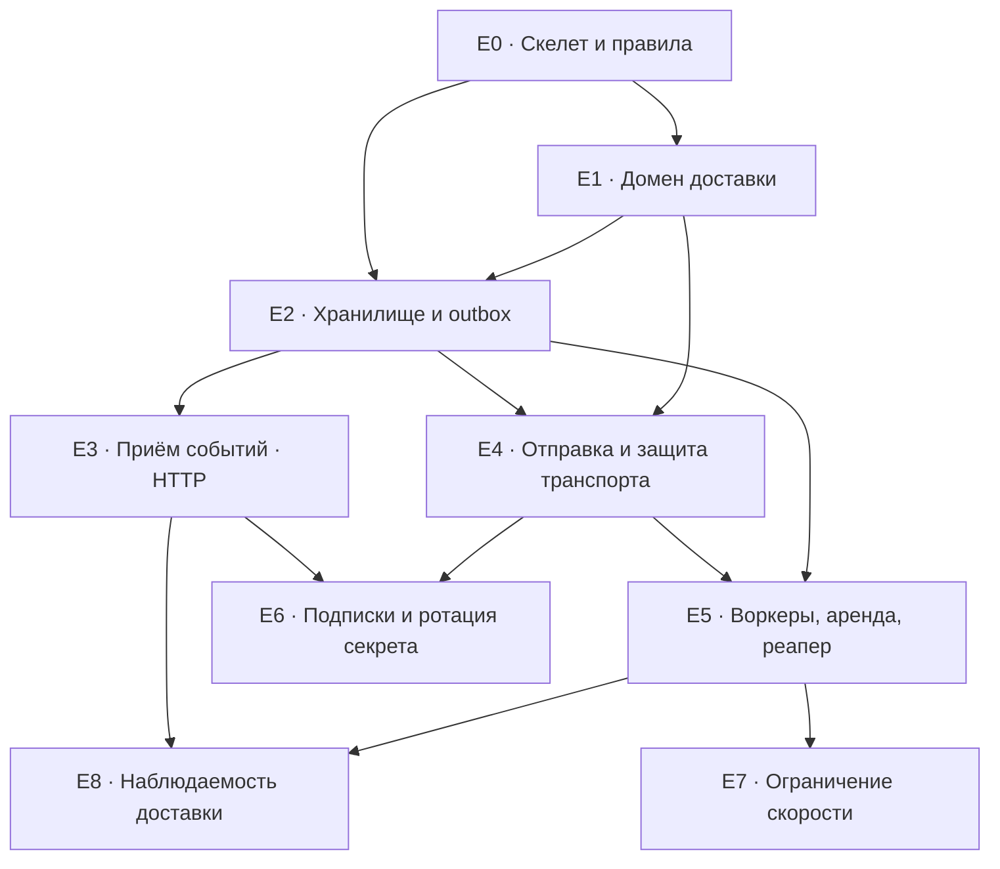

# Разбивка по эпикам — Webhook Dispatcher

Карта: какие куски архитектуры в какой эпик ложатся и в каком порядке строятся. Спутник `ARCHITECTURE-SPINE.md`; ссылки на `AD-n` и `FR-n` — стабильные.

## Порядок и зависимости

Критический путь до первой сквозной доставки: **E0 → E1 → E2 → E3 → E4 → E5**. E6, E7, E8 наращивают на работающий ствол.

## Эпики

### E0 · Скелет проекта и правила консистентности

**Даёт:** структуру каталогов, composition root, конфиг, жизненный цикл, тест на импорты.
**Архитектура:** AD-1, AD-4, AD-5, AD-16, AD-17, AD-19, AD-21; раздел Stack; дерево исходников.
**FR:** FR-22 (частично — каркас graceful shutdown).
**Готово, когда:** пустой сервис поднимается, отвечает на health, корректно гасится по сигналу; тест на направление импортов падает при попытке импортировать адаптер из домена; конфиг валидируется при старте, включая инвариант «таймаут аренды > таймаута отправки».

### E1 · Чистый домен доставки

**Даёт:** сущности, машину состояний, чистые instruction'ы, доменные ошибки.
**Архитектура:** AD-8, AD-10, AD-11, AD-18, AD-22, AD-23; конвенции статусов и времени.
**FR:** FR-9, FR-15, FR-17, FR-18, FR-19; расчётные части FR-14.
**Готово, когда:** unit-тесты покрывают допустимые и запрещённые переходы, монотонность и потолок бэкоффа, наличие джиттера при детерминированном `RandSource`, HMAC на известных векторах, разбор обеих форм `Retry-After`. Ни одного обращения к БД, сети и `time.Now()`.

**Строится раньше всего остального, кроме скелета** — это единственный эпик, целиком проверяемый без инфраструктуры, и он фиксирует смысл, на который опираются все последующие.

### E2 · Хранилище, транзакции и Transactional Outbox

**Даёт:** схему БД, миграции, репозитории, `TxManager`, идемпотентность на индексе.
**Архитектура:** AD-2, AD-6, AD-7, AD-11, AD-19; ERD; конвенция миграций.
**FR:** FR-6, FR-7, FR-8.
**Готово, когда:** тест против реальной БД в контейнере показывает, что сбой на середине создания Попыток доставки не оставляет Событие; два конкурентных запроса с одним `Idempotency-Key` дают одно Событие; полезная нагрузка возвращается из БД байт в байт.

### E3 · Приём событий (HTTP)

**Даёт:** `POST /api/v1/events`, маппинг доменных ошибок, единую форму ошибки.
**Архитектура:** AD-3, AD-5, AD-20.
**FR:** FR-4, FR-5.
**Готово, когда:** публикация возвращает `202` с идентификаторами, запрос без `Idempotency-Key` — `400`, повтор с тем же ключом и другим телом — `409`, и все ответы об ошибке имеют одну форму.

### E4 · Отправка вебхука и защита транспорта

**Даёт:** HTTP-отправитель, SSRF-guard в `DialContext`, запрет редиректов, нейтральный результат отправки.
**Архитектура:** AD-12, AD-13, AD-15.
**FR:** FR-12, FR-13, FR-15.
**Готово, когда:** запрос уходит с корректным `X-Signature` и `User-Agent`, таймаут 5 с соблюдается, соединение с loopback/приватным/link-local адресом и `169.254.169.254` не устанавливается (табличный тест), `Send` не принимает решений о повторе.

**Развилка риска:** SSRF-guard — единственное место, где ошибка тихо превращается в уязвимость. Тест должен покрывать редирект на внутренний адрес и DNS-имя, резолвящееся в приватный диапазон, а не только литеральные IP.

### E5 · Воркеры, аренда и реапер

**Даёт:** пул воркеров, атомарную выборку с арендой, реапер, сквозную доставку.
**Архитектура:** AD-9, AD-17, AD-22.
**FR:** FR-10, FR-11, FR-14, FR-22.
**Готово, когда:** событие проходит весь путь до `DELIVERED` на живом подписчике и до `DEAD_LETTER` на мёртвом; убийство процесса в момент отправки не оставляет запись в `SENDING` дольше таймаута аренды; тест с несколькими воркерами под `-race` не выдаёт одну Попытку доставки дважды.

**После этого эпика сервис делает то, ради чего он есть.** E6 — E8 — обвязка.

### E6 · Подписки и ротация секрета

**Даёт:** `POST /api/v1/subscriptions`, ротацию с Плавным переходом, двойную подпись.
**Архитектура:** AD-12, AD-18, AD-20.
**FR:** FR-1, FR-2, FR-3, FR-16.
**Готово, когда:** секрет не появляется ни в одном ответе и логе (тест на сериализацию `entity.Secret`), в течение Плавного перехода запрос несёт две подписи и обе валидны, после истечения — одну.

**Зависит от E4:** двойная подпись бессмысленна, пока некому отправлять.

### E7 · Двухуровневое ограничение скорости

**Даёт:** бакет Подписки, бакет Целевого хоста, возврат задачи без расхода попытки.
**Архитектура:** AD-14, AD-22, AD-23.
**FR:** FR-20.
**Готово, когда:** нагрузочный тест показывает соблюдение `max_rps` Подписки и лимита хоста при нескольких Подписках на один хост; отказ лимитера не увеличивает Номер попытки и не пишет результат последнего ответа.

**Ставится после E5 намеренно:** лимитер меняет путь выполнения воркера, и отлаживать его проще на работающей доставке.

### E8 · Наблюдаемость доставки

**Даёт:** `GET /api/v1/deliveries/{id}`, структурированные логи переходов.
**Архитектура:** AD-20, AD-21.
**FR:** FR-21.
**Готово, когда:** статус, номер попытки, момент следующей попытки, код и время последнего ответа возвращаются одним запросом; каждый переход состояния находится в логах по `delivery_id`; полезная нагрузка в логах отсутствует.

## Что осталось вне эпиков

Пункты `Deferred` из spine и открытые вопросы PRD № 1, 7, 8, 11, 12. Ближайший к телу: **распределённый Ограничитель скорости** — при выкате более одной реплики E7 перестаёт держать заявленный лимит хоста, и это надо признать до продакшена, а не после.
